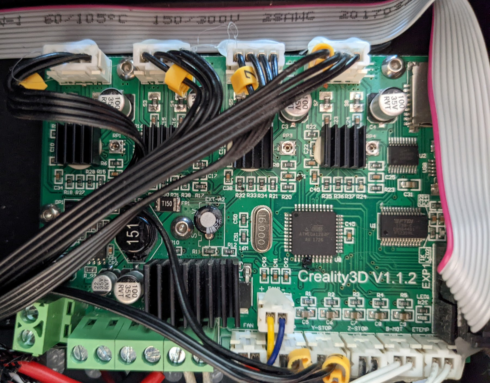

# Ender 3

I use Ender 3 3D printer which I bought in June 2018 for $238. It was upgraded with:
* July 2018:
    * Nozzle set 0.2 - 0.5mm for $7.99
* July 2019:
    * NEMA 17 Stepper motors for X and Y axis:
        * Vibration dampers - 3pcs for $5.64
        * Heat sinks 40x40x11.3mm - 5pcs for $2.48
    * Heatbed springs 8mm OD x 25mm - 5pcs for $0.99
* November 2021:
    * Glass Bed, 235x235x4mm for $15.99
    * Heater silicon cover - 3pcs for $7.89
    * NTC Thermistor sensor 100K - 5pcs for $9.89

## Firmware

Ender 3 board version is Creality3D v1.1.2. It is also called "Melzi" and uses the Atmel 1284p CPU.

I've tried several FW and ended up with TH3D Unified 2 firmware for "Melzi" board ([details](https://www.th3dstudio.com/hc/downloads/unified-2-firmware/creality/creality-boards-creality/creality-ender-3-firmware-melzi-board/)).

I use [Octoprint Firmware Updater](https://github.com/OctoPrint/OctoPrint-FirmwareUpdater/blob/master/README.md) to update the printer FW.

### Firmware configuration

I prefer compiling FW using command line tools inside Python virtual environment.
There are several parameters to setup before flashing - [Configuration.h](fw/Configuration.h)
To build a new FW version simple run the script - [th3d_fw_build.sh](fw/th3d_fw_build.sh)
