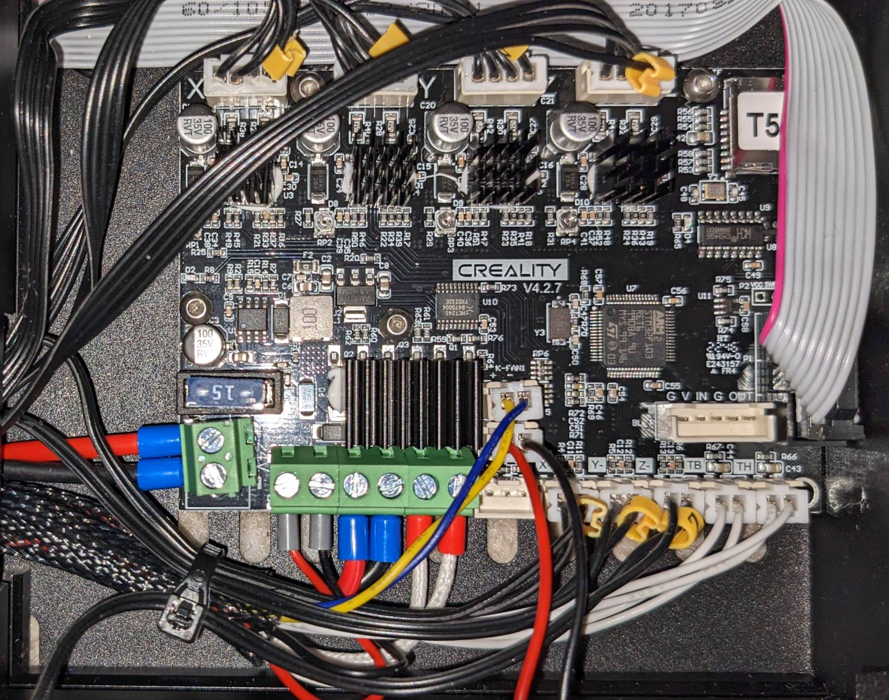

# Ender 3

I use Ender 3 3D printer which I bought in June 2018 for $238. It was upgraded with:
* July 2018:
  * Nozzle set 0.2 - 0.5mm for $7.99
* July 2019:
  * NEMA 17 Stepper motors for X and Y axis:
    * Vibration dampers - 3pcs for $5.64
    * Heat sinks 40x40x11.3mm - 5pcs for $2.48
  * Heatbed springs 8mm OD x 25mm - 5pcs for $0.99
* November 2021:
  * Glass Bed, 235x235x4mm for $15.99
  * Heater silicon cover - 3pcs for $7.89
  * NTC Thermistor sensor 100K - 5pcs for $9.89
* February 2023:
  * Silent main control board v4.2.7 with TMC2225 Driver for $39.99

## Firmware

Ender 3 was upgraded with Creality3D main board v4.2.7.  
It is also known as a silent board and uses the 32-bit STM32 microcontroller instead of a standard 8-bit ATmega 1284p.

I've tried different firmware and ended up with Marlin 2 for v4.2.7 board ([details](https://github.com/MarlinFirmware/Configurations/tree/release-2.1.2/config/examples/Creality/Ender-3/CrealityV427)).

### Firmware configuration

This configuration is compatible with the v4.2.7 board STM32F103RET6 (512Kb flash) chips only.

I prefer compiling the firmware code using command line tools inside Python virtual environment.  
There are several parameters to setup - [Configuration.h](fw/Configuration.patch) and [Configuration_adv.h](fw/Configuration_adv.patch)  
To build a new firmware version just run the script - [marlin_fw_build.sh](fw/marlin_fw_build.sh)

### Firmware update

I use the SD card method to update the printer.

* Prepare a MicroSD card. The card should be formatted as FAT32, and be empty.
* Copy the newly built firmware (eg. firmware-20230219-035927.bin) to the card.
* Make sure your 3D printer is turned off.
* Insert the MicroSD card into the Ender 3.
* Turn the printer on. It will take about 15 seconds (shouldn't take more than a minute) to install the new firmware.
* Done
